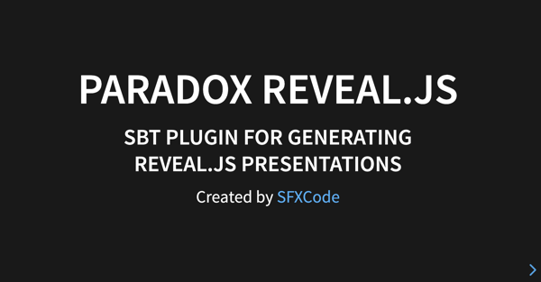

# Demo

## Simple Presentation

Put following code in your index.md file of the paradox folder.

```
@@@ slide
# My First Presentation
This Preasentation was made by Paradox and reveal.js
@@@

@@@ slide
## Congratulation
Your second slide is ready !
@@@
@@@ slide

# The END
@@@
```
Your first presentation with 3 slides is ready ...

Use sbt paradox command.

## Complex Presentations

For more complex presentations use the directives documentation or take a look at the showcase.

## Showcase




A [Showcase](reveal_demo.html) build with this plugin.

Press ```s``` for the reveal.js speaker viev.

### Showcase sources

Source code of this demo is in the demo folder of this project.
